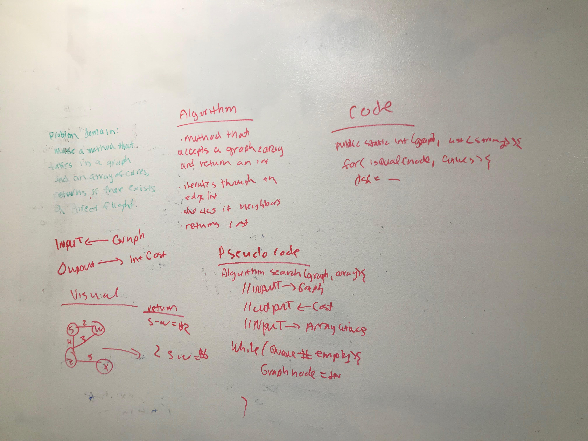

# Find Edges
<!-- Short summary or background information -->
Graph is a data structure that consists of following two components:
1. A finite set of vertices also called as nodes.
2. A finite set of ordered pair of the form (u, v) called as edge. The pair is ordered because (u, v) is not same as (v, u) in case of a directed graph(di-graph). The pair of the form (u, v) indicates that there is an edge from vertex u to vertex v. The edges may contain weight/value/cost.

 Graphs are used to represent many real-life applications: Graphs are used to represent networks. The networks may include paths in a city or telephone network or circuit network. Graphs are also used in social networks like linkedIn, Facebook. For example, in Facebook, each person is represented with a vertex(or node). Each node is a structure and contains information like person id, name, gender and locale. See this for more applications of graph.

source: https://www.geeksforgeeks.org/graph-and-its-representations/

## Challenge
<!-- Description of the challenge -->
Feature Tasks
* Write a function based on the specifications above, which takes in a graph, and an array of city names. Without utilizing any of the built-in methods available to your language, return whether the full trip is possible with direct flights, and how much it would cost.

## Approach & Efficiency
<!-- What approach did you take? Why? What is the Big O space/time for this approach? -->

I drew a picture to understand the difference between bi-directional/undirected vs directed.

Then I drew a picture of what my results should look like.
Space/Time: O(n)

## Solution
<!-- Embedded whiteboard image -->
