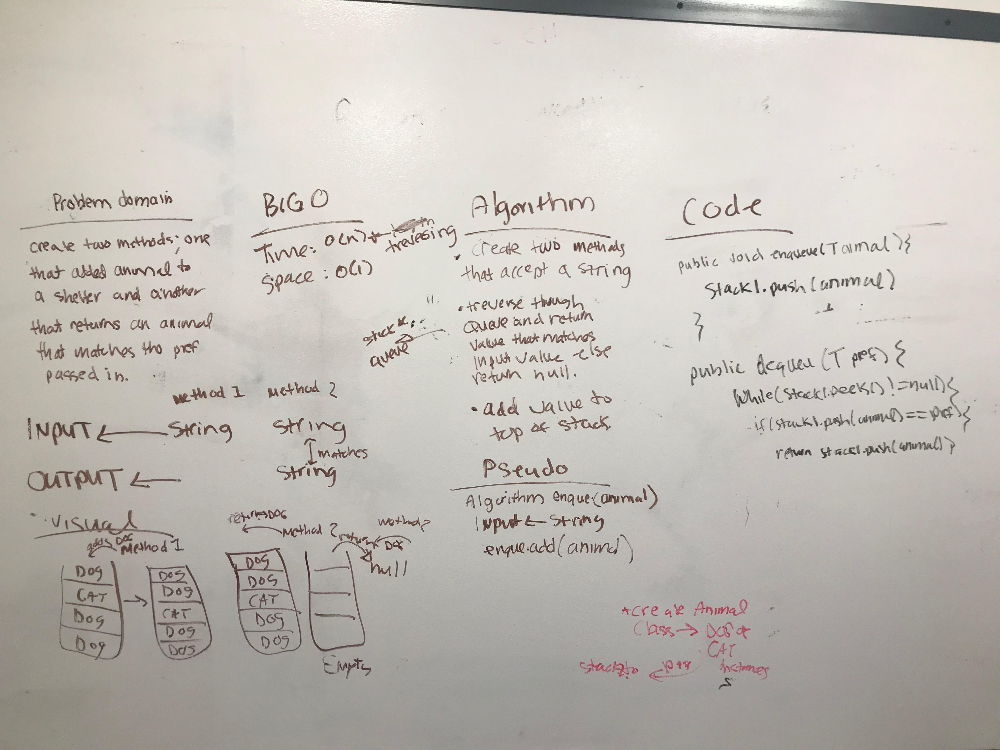

# First-in, First out Animal Shelter.
<!-- Short summary or background information -->
##What is a Stack:
A stack is a data structure that consists of Nodes.
Each Node references the next node in the stack, but does not reference it’s previous

Stacks follow these concepts:
FILO concept: First In Last Out. This means that the first item in the stack, will be the last item out.
LIFO concept: Last In First Out This means that the last item in the stack, will be the first item out.

##What is a Queue:
Common terminology for a queue is:

Enqueue - Nodes or items that are added to the queue.
Dequeue - Nodes or items that are removed from the queue.
Front - This is the front/first node of the queue.
Rear - This is the rear/last node of the queue.
Peek - When you Peek you will view the Top node in the stack. If the stack is empty,
and you don’t Peek, you will receive a NullReferenceException

##Queues follow these concepts:
FIFO - First In First Out - This means that the first item in the queue will be the first item out of the queue.
LILO - Last In Last Out - This means that the last item in the queue will be the last item out of the queue.

## Challenge
<!-- Description of the challenge -->
The challenge given was to create:

1.Create a class called AnimalShelter which holds only dogs and cats. The shelter operates using a first-in,
first-out approach.

##Implement the following methods:

  1.enqueue(animal): adds animal to the shelter. animal can be either a dog or a cat object.
  2.dequeue(pref): returns either a dog or a cat. If pref is not "dog" or "cat" then return null

## Approach & Efficiency
<!-- What approach did you take? Why? What is the Big O space/time for this approach? -->
The approach that I took was to initially draw out the problem domain. The Big O for space/time: O(1)

## Solution
<!-- Embedded whiteboard image -->

