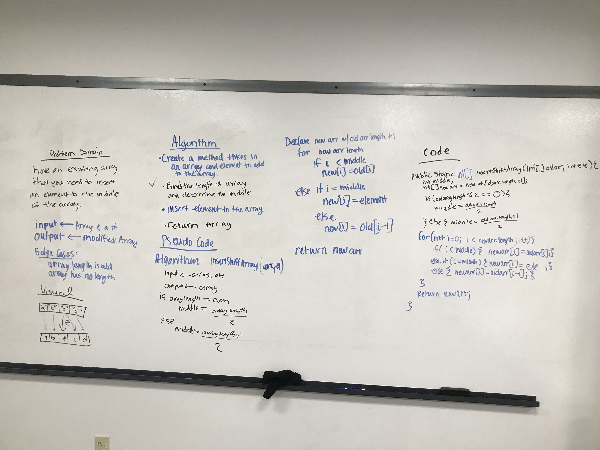

////////////////////////////////////////////////////////////////////////////////////
# Insert and shift middle index of array
<!-- Short summary or background information -->
Taking an existing array and insert an element to the middle of the array.
## Challenge
<!-- Description of the challenge -->
It was a challenge to come up with the right condition so that you don't  lose an elements but shift them

## Approach & Efficiency
<!-- What approach did you take? Why? What is the Big O space/time for this approach? -->
I ended up drawing a picture for to then to create a new array with a length of the old array plus one

## Solution
<!-- Embedded whiteboard image -->
