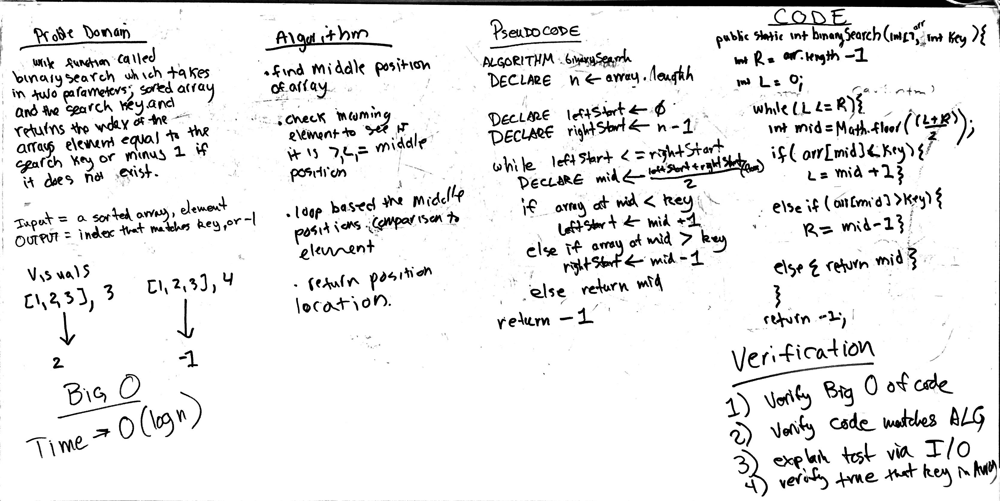

////////////////////////////////////////////////////////////////////////////////////
# Binary Search
<!-- Short summary or background information -->
This function called binary search takes in tow parameters, a sorted array and search
key. It returns the index of the array element that equals to the search key or minus
one of it does not exist.

## Challenge
<!-- Description of the challenge -->
Writing the tests and making sure that they make sense.

## Approach & Efficiency
<!-- What approach did you take? Why? What is the Big O space/time for this approach? -->
The approach was to first conceptualize what the solution should/would look like. The big O
was O(log sub n). The code was effiect in the sense that it readjusted for the array length
depending on what the mid point was compared to the key.
## Solution
<!-- Embedded whiteboard image -->

////////////////////////////////////////////////////////////////////////////////////