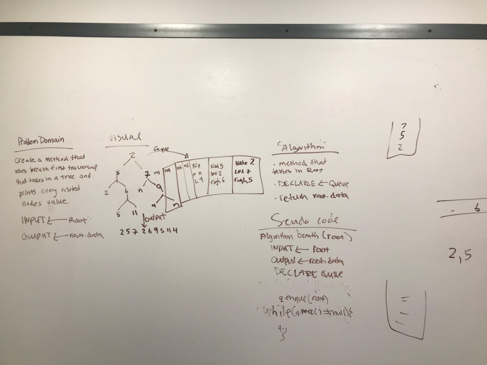

# Breadth-first
<!-- Short summary or background information -->
Breadth First
The breadth first traversal iterates through the tree by going through each level of the tree node by node.

This Code Challenge used a Queue to solve the problem domain
## What is a Queue:
Common terminology for a queue is:

Enqueue - Nodes or items that are added to the queue.
Dequeue - Nodes or items that are removed from the queue.
Front - This is the front/first node of the queue.
Rear - This is the rear/last node of the queue.
Peek - When you Peek you will view the Top node in the stack. If the stack is empty,
and you don’t Peek, you will receive a NullReferenceException

## Queues follow these concepts:
FIFO - First In First Out - This means that the first item in the queue will be the first item out of the queue.
LILO - Last In Last Out - This means that the last item in the queue will be the last item out of the queue.

## Challenge
<!-- Description of the challenge -->
Write a breadth first traversal method which takes a Binary Tree as its unique input. Without utilizing any of the built-in methods available to your language, traverse the input tree using a Breadth-first approach; print every visited node’s value.

## Approach & Efficiency
<!-- What approach did you take? Why? What is the Big O space/time for this approach? -->
The approach that I took was to initially draw out the problem domain. The Big O for space/time: O(n)

## Solution
<!-- Embedded whiteboard image -->

