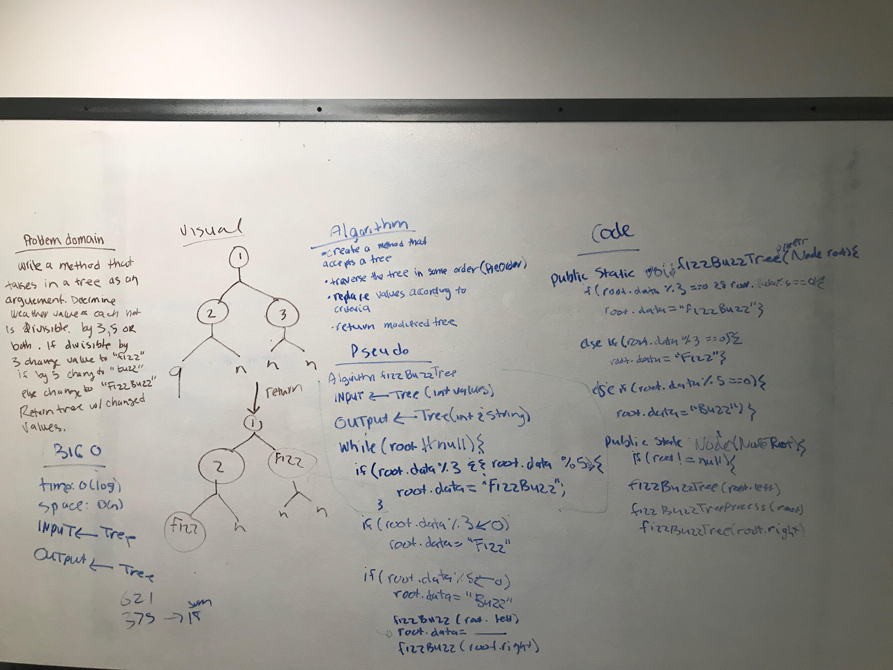

# FizzBuzz Tree
<!-- Short summary or background information -->
This code challenge uses:

1.Binary Tree
2.Node

# Common Terminology
Node - a node is the individual item/data that make up the data structure.

Root - The root is the first/top Node in a tree

Left Child - The node that is positioned to the left of the root

Right Child - The node that is positioned to the right of the root

# Traversals
There are two categories of traversals when it comes to trees, for this challenge I used:

    1. Depth First

Here are the three different depth first traversals this code challenge used:

Inorder
left root right

## Challenge
<!-- Description of the challenge -->
1.Write a function called FizzBuzzTree which takes a tree as an argument. determine weather or not the value of each node is divisible by 3, 5 or both, and change the value of each of the nodes:

                                                  If the value is divisible by 3, replace the value with “Fizz”
                                                  If the value is divisible by 5, replace the value with “Buzz”
                                                  If the value is divisible by 3 and 5, replace the value with “FizzBuzz”

2.Return the tree with its news values

## Approach & Efficiency
<!-- What approach did you take? Why? What is the Big O space/time for this approach? -->
 I started with a picture for each method drawing out the functionality and return value(node).
 Big O space:O(n)
 Big O time: O(log)

## Solution
<!-- Embedded whiteboard image -->
