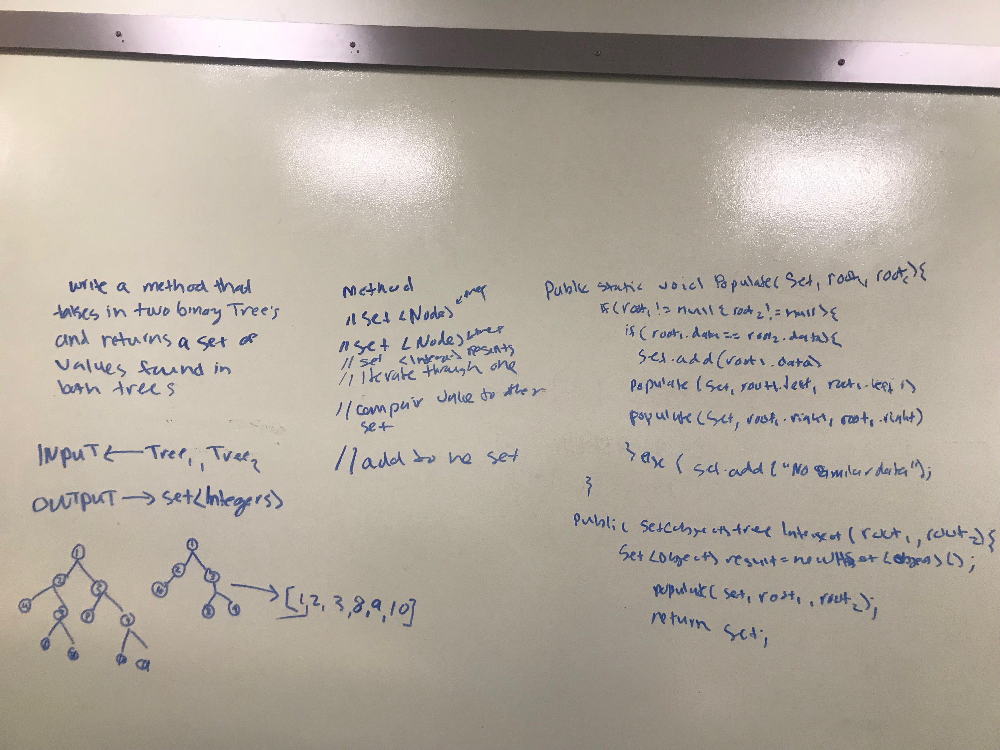

# Hashmap LEFT JOIN
<!-- Short summary or background information -->
Hashing is a technique that is used to uniquely identify a specific object from a group of similar objects. Some examples of how hashing is used in our lives include:

* In universities, each student is assigned a unique roll number that can be used to retrieve information about them.
* In libraries, each book is assigned a unique number that can be used to determine information about the book, such as its exact position in the library or the users it has been issued to etc.

In both these examples the students and books were hashed to a unique number.

Assume that you have an object and you want to assign a key to it to make searching easy. To store the key/value pair, you can use a simple array like a data structure where keys (integers) can be used directly as an index to store values. However, in cases where the keys are large and cannot be used directly as an index, you should use hashing.

In hashing, large keys are converted into small keys by using hash functions. The values are then stored in a data structure called hash table. The idea of hashing is to distribute entries (key/value pairs) uniformly across an array. Each element is assigned a key (converted key). By using that key you can access the element in O(1) time. Using the key, the algorithm (hash function) computes an index that suggests where an entry can be found or inserted.

Hashing is implemented in two steps:

1. An element is converted into an integer by using a hash function. This element can be used as an index to store the original element, which falls into the hash table.
2. The element is stored in the hash table where it can be quickly retrieved using hashed key.

hash = hashfunc(key)
index = hash % array_size

In this method, the hash is independent of the array size and it is then reduced to an index (a number between 0 and array_size − 1) by using the modulo operator (%).

source: https://www.hackerearth.com/practice/data-structures/hash-tables/basics-of-hash-tables/tutorial/

## Challenge
<!-- Description of the challenge -->
* Write a function that LEFT JOINs two hashmaps into a single data structure.
* The first parameter is a hashmap that has word strings as keys, and a synonym of the key as values.
* The second parameter is a hashmap that has word strings as keys, and antonyms of the key as values.
* Combine the key and corresponding values (if they exist) into a new data structure according to LEFT JOIN logic.
* LEFT JOIN means all the values in the first hashmap are returned, and if values exist in the “right” hashmap, they are appended to the result row. If no values exist in the right hashmap, then some flavor of NULL should be appended to the result row.
* The returned data structure that holds the results.

## Approach & Efficiency
<!-- What approach did you take? Why? What is the Big O space/time for this approach? -->
I created a nested array list that I would populate with my final results. I looped through the first map1 and checked if the key of map2 was similar with the ket to map1. if similar add them to a list else return the values of map1 but with null.
The following have Big O of O(1):

## Solution
<!-- Embedded whiteboard image -->
