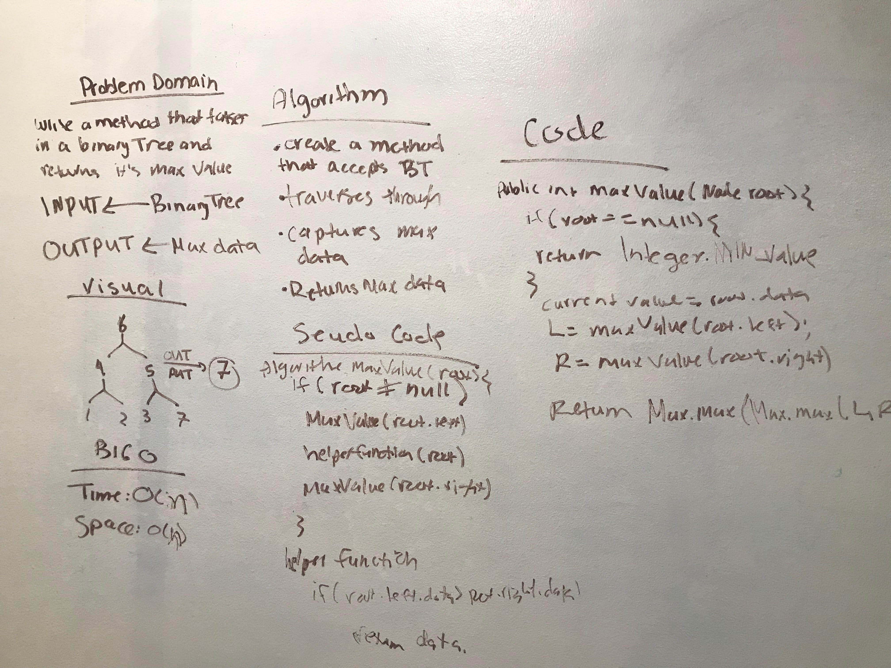

//http://www.makeinjava.com/find-minimum-maximum-element-binary-tree-recursive-java-example/

# Find the Maximum Value in a Binary Tree
<!-- Short summary or background information -->
This code challenge uses:

1.Binary Tree
2.Node

# Common Terminology
Node - a node is the individual item/data that make up the data structure.

Root - The root is the first/top Node in a tree

Left Child - The node that is positioned to the left of the root

Right Child - The node that is positioned to the right of the root

## Challenge
<!-- Description of the challenge -->
Write a function called find-maximum-value which takes binary tree as its only input. Without utilizing any of the built-in methods available to your language, return the maximum value stored in the tree. You can assume that the values stored in the Binary Tree will be numeric.
## Approach & Efficiency
<!-- What approach did you take? Why? What is the Big O space/time for this approach? -->
The approach was to first conceptualize what the solution should/would look like. The big O for time and space
was O(n).

## Solution
<!-- Embedded whiteboard image -->
