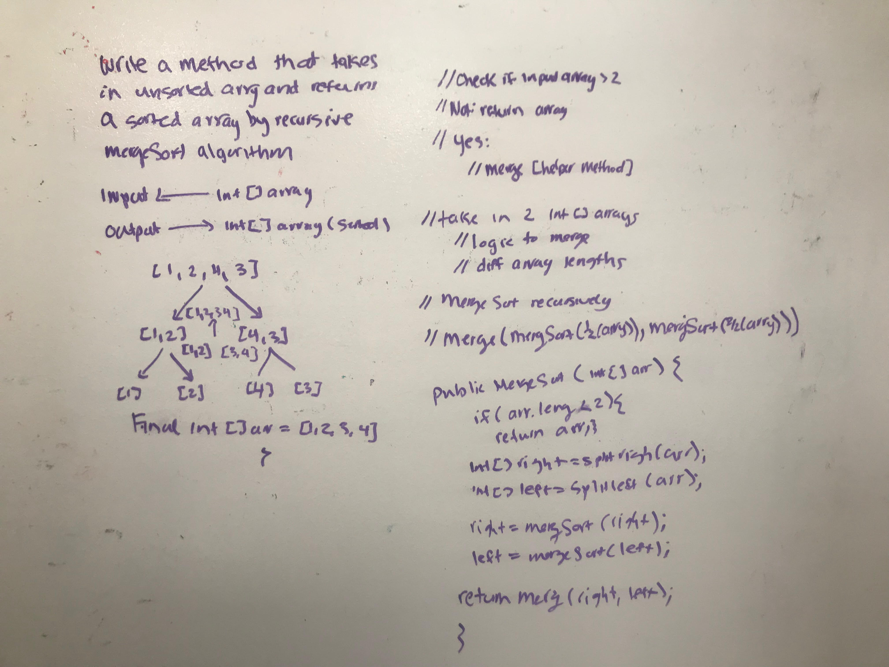

# Mergesort
<!-- Short summary or background information -->
Merge sort is one of the most efficient sorting algorithms. It works on the principle of Divide and Conquer. Merge sort repeatedly break down a list into several sublists until each sublist consists of a single element and merging those sublists in a manner that results into a sorted list.

A merge sort works as follows:
Divide the unsorted list into n sublists, each comprising 1 element (a list of 1 element is supposed sorted).
Repeatedly merge sublists to produce newly sorted sublists until there is only 1 sublist remaining. This will be the sorted list.
Merging of two lists done as follows:
The first element of both lists is compared. If sorting in ascending order, the smaller element among two becomes a new element of the sorted list. This procedure is repeated until both the smaller sublists are empty and the newly combined sublist covers all the elements of both the sublists.
source: https://www.interviewbit.com/tutorial/merge-sort-algorithm/

source: https://www.geeksforgeeks.org/merge-sort/

## Challenge
<!-- Description of the challenge -->
Write a function that accepts an array of unsorted integers, and returns a sorted array by a recursive mergesort algorithm.

## Approach & Efficiency
<!-- What approach did you take? Why? What is the Big O space/time for this approach? -->
Draw a picture to get started based on the input and output requirements.
space: O(n)
Time O(nlog(n))

## Solution
<!-- Embedded whiteboard image -->
