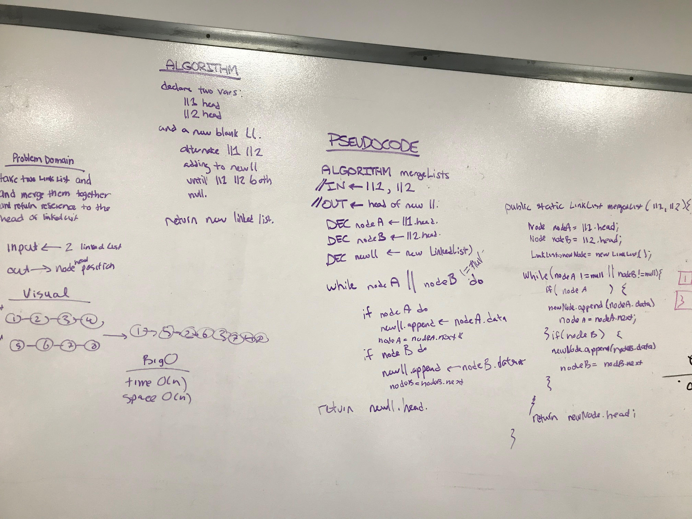

# Merge two Linked Lists
<!-- Short summary or background information -->
Write a function called mergeLists which takes two linked lists as arguments.
Zip the two linked lists together into one so that the nodes alternate between the
two lists and return a reference to the head of the zipped list.

## Challenge
<!-- Description of the challenge -->
The challenge for this wa accounting for the length differences  of the passed
in linkedlists.

## Approach & Efficiency
<!-- What approach did you take? Why? What is the Big O space/time for this approach? -->
drawing a picture was really helpful
## Solution
<!-- Embedded whiteboard image -->
