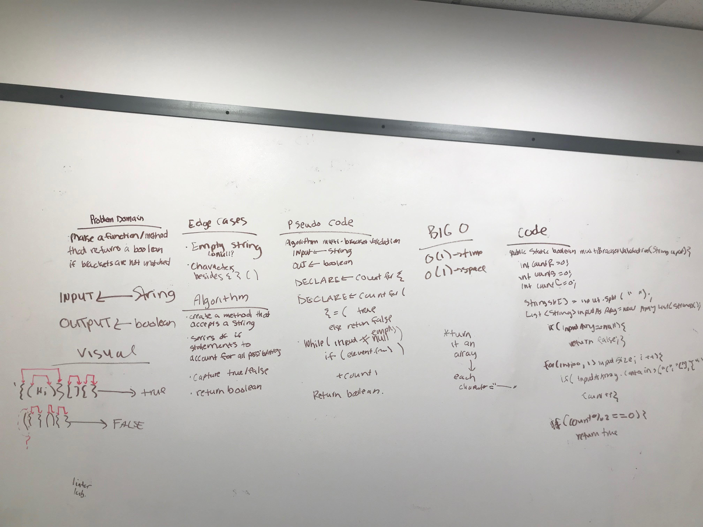

# Multi-bracket Validation.
<!-- Short summary or background information -->

Your function should take a string as its only argument, and should return a boolean representing whether or not the brackets in the string are balanced. There are 3 types of brackets:

Round Brackets : ()
Square Brackets : []
Curly Brackets : {}

## Challenge
<!-- Description of the challenge -->

The challenge given was to create:

1. To create a method called multiBracketValidation(String input)  that checks if brackets are balanced in a given String input and return false if they were not.

## Approach & Efficiency
<!-- What approach did you take? Why? What is the Big O space/time for this approach? -->
The approach that I took was to initially draw out the problem domain and consider all the edge cases. The Big O for space/time: O(1)

## Solution
<!-- Embedded whiteboard image -->
