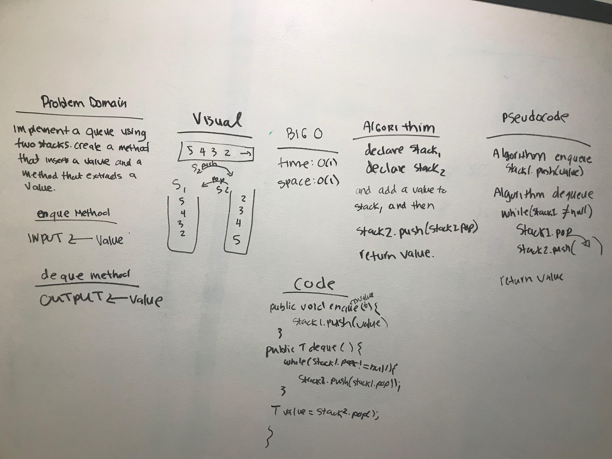

# Implement a Queue using two Stacks.
<!-- Short summary or background information -->
Created a brand new PseudoQueue class that does not use an existing Queue. Instead, this
PseudoQueue class will implement the standard queue interface, but will internally only utilize 2 Stack objects.
Basically implementing a queue using two stacks.I used my own Stack implementation. Instantiate these Stack objects
in my PseudoQueue constructor.

## Challenge
<!-- Description of the challenge -->
## PseudoQueue Class:

1. method: enqueue(value) which inserts value into the PseudoQueue, using a first-in, first-out approach.
2.method: dequeue() which extracts a value from the PseudoQueue, using a first-in, first-out approach.

## Approach & Efficiency
<!-- What approach did you take? Why? What is the Big O space/time for this approach? -->

The approach that I took was to initially draw out the problem domain. The Big O for space/time: O(1)

## Solution
<!-- Embedded whiteboard image -->
