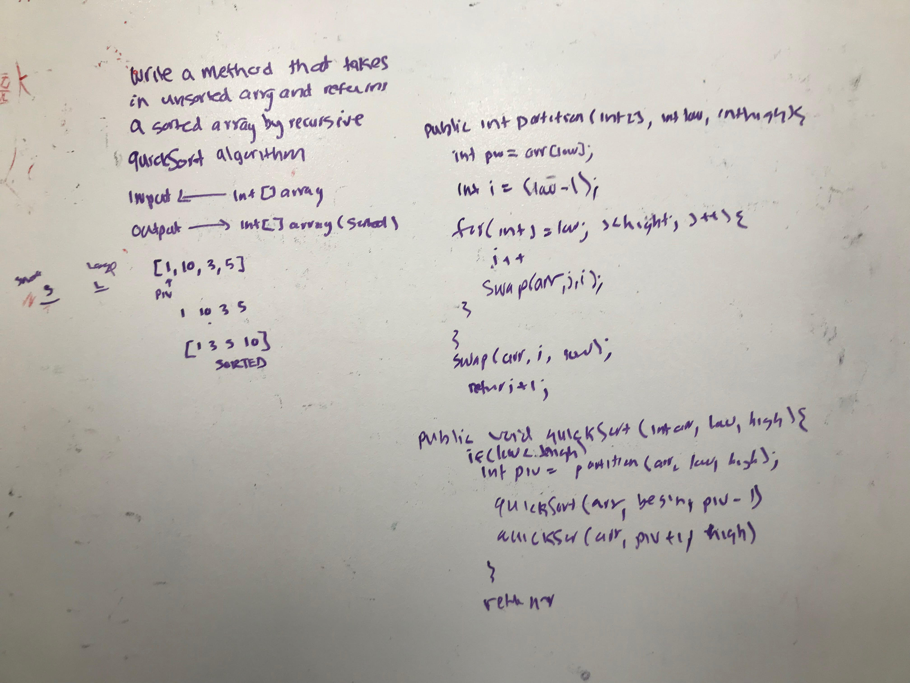

# Quicksort
<!-- Short summary or background information -->
Like Merge Sort, QuickSort is a Divide and Conquer algorithm. It picks an element as pivot and partitions the given array around the picked pivot. There are many different versions of quickSort that pick pivot in different ways.

Always pick first element as pivot.
Always pick last element as pivot (implemented below)
Pick a random element as pivot.
Pick median as pivot.
The key process in quickSort is partition(). Target of partitions is, given an array and an element x of array as pivot, put x at its correct position in sorted array and put all smaller elements (smaller than x) before x, and put all greater elements (greater than x) after x. All this should be done in linear time.

source: https://www.geeksforgeeks.org/quick-sort/

## Challenge
<!-- Description of the challenge -->
Write a function that accepts an array of integers, and returns an array sorted by a recursive quicksort algorithm.

## Approach & Efficiency
<!-- What approach did you take? Why? What is the Big O space/time for this approach? -->
Then I drew a picture of what my results should look like.
At most the big O of Time: O(n^2)
big O of space = O(1)

## Solution
<!-- Embedded whiteboard image -->

