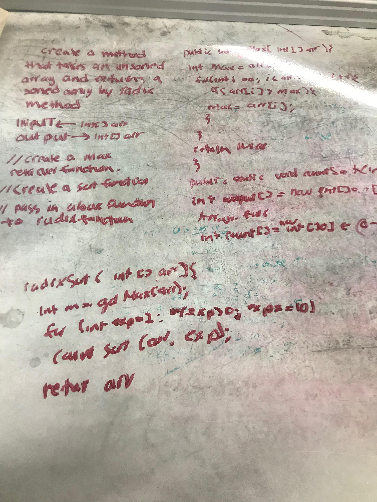

# RadixSort
<!-- Short summary or background information -->
QuickSort, MergeSort, HeapSort are comparison based sorting algorithms.
CountSort is not comparison based algorithm. It has the complexity of , where  is the maximum element of the input array.
So, if  is  ,CountSort becomes linear sorting, which is better than comparison based sorting algorithms that have  time complexity. The idea is to extend the CountSort algorithm to get a better time complexity when k goes . Here comes the idea of Radix Sort.

Algorithm:
For each digit  where  varies from the least significant digit to the most significant digit of a number
    Sort input array using countsort algorithm according to ith digit.

We used count sort because it is a stable sort.

Advantages :
1. Fast when the keys are short i.e. when the range of the array elements is less.
2. Used in suffix array constuction algorithms like Manber's algorithm and DC3 algorithm.

Disadvantages:
1. Since Radix Sort depends on digits or letters, Radix Sort is much less flexible than other sorts. Hence , for every different type of data it needs to be rewritten.
2. The constant for Radix sort is greater compared to other sorting algorithms.
3. It takes more space compared to Quicksort which is inplace sorting.
source: https://www.hackerearth.com/practice/algorithms/sorting/radix-sort/tutorial/

source: //source: https://www.geeksforgeeks.org/radix-sort/
## Challenge
<!-- Description of the challenge -->
Write a function that accepts an array of positive integers, and returns an array sorted by a radix sort algorithm

## Approach & Efficiency
<!-- What approach did you take? Why? What is the Big O space/time for this approach? -->

Space: O(n)
Time: O(n * logn(n))

## Solution
<!-- Embedded whiteboard image -->

