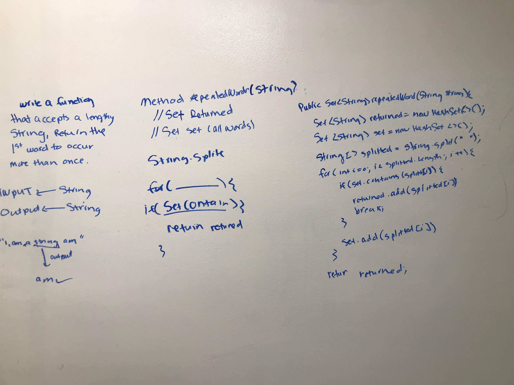

# First repeated word
<!-- Short summary or background information -->
The data structure I used :
Set in Java
Set is an interface which extends Collection. It is an unordered collection of objects in which duplicate values cannot be stored.

Basically, Set is implemented by HashSet, LinkedHashSet or TreeSet (sorted representation).

Set has various methods to add, remove clear, size, etc to enhance the usage of this interface

source: https://www.geeksforgeeks.org/set-in-java/

## Challenge
<!-- Description of the challenge -->
* Write a function that accepts a lengthy string parameter.
* Without utilizing any of the built-in library methods available to your language, return the first word to occur more than once in that provided string.

## Approach & Efficiency
<!-- What approach did you take? Why? What is the Big O space/time for this approach? -->
I created a visual what an an expected output is given an input. The big O is O(n)

## Solution
<!-- Embedded whiteboard image -->
