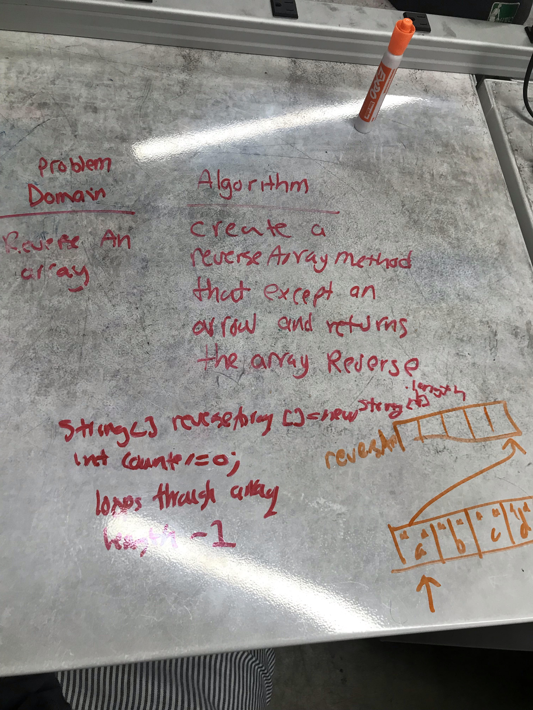

# Reverse an Array
<!-- Short summary or background information -->
The problem domain was basically to reverse an array
## Challenge
<!-- Description of the challenge -->
Creating a new array

## Approach & Efficiency
<!-- What approach did you take? Why? What is the Big O space/time for this approach? -->
Drew a picture to realize what the final answer for any given array should look like

Space O()
Time O()

## Solution
<!-- Embedded whiteboard image -->

