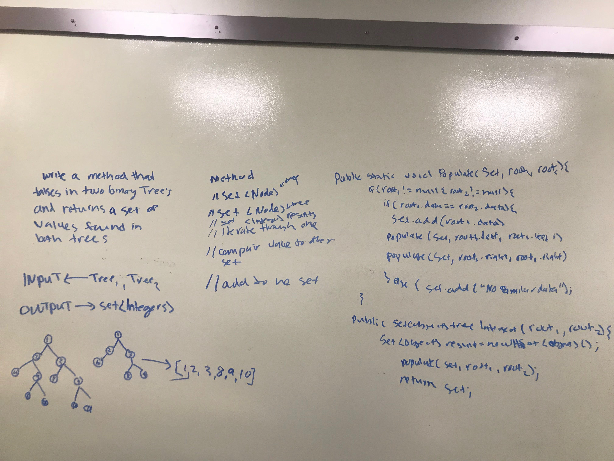

# Intersection of binary trees
<!-- Short summary or background information -->
#### Trees
<!-- Short summary or background information -->
There are two different types of trees that this lab uses:

1.Binary Trees

2.Binary Search Trees

#### Common Terminology
Node - a node is the individual item/data that make up the data structure.

Root - The root is the first/top Node in a tree

Left Child - The node that is positioned to the left of the root

Right Child - The node that is positioned to the right of the root

#### Traversals
There are two categories of traversals when it comes to trees:

    1. Depth First
    2. Breadth First
Depth First
Depth first is a traversal that traverses the depth (height) of the tree.

The different traversals determine at which point the Root is looked at.
Here are the three different depth first traversals broken down:

Preorder
Root, Left, Right

Inorder
Left, Root, Right

Postorder
Left, Right, Root

## Challenge
<!-- Description of the challenge -->
Write a function called tree_intersection that takes two binary tree parameters.
Without utilizing any of the built-in library methods available to your language, return a set of values found in both trees.

## Approach & Efficiency
<!-- What approach did you take? Why? What is the Big O space/time for this approach? -->
I started with a picture for each method drawing out the functionality and return value(node or int).
 Big O space:O(n)
 Big O time: O(log)

## Solution
<!-- Embedded whiteboard image -->
